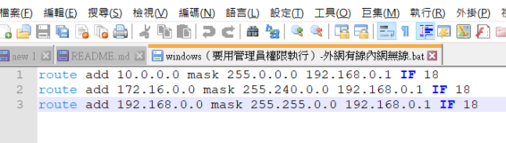
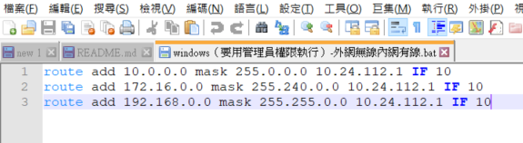

# Router Setting

### **雙網卡同時連線設定**
用ROUTE.設定區網.外網跑不同Gateway
### 在命令列(Command-Line)中使用如下命令
```Groovy
route print
```
**情況一、外網有線內網無線**
```Groovy
        ===========================================================================
        介面清單
          9...fa 34 41 24 14 45 ......Microsoft Wi-Fi Direct Virtual Adapter
         14...f8 34 41 24 14 46 ......Microsoft Wi-Fi Direct Virtual Adapter #2
         20...c2 d0 12 b8 4b 36 ......Apple Mobile Device Ethernet
         10...00 e0 4c 36 1d 7a ......Realtek USB FE Family Controller #2
         18...f8 34 41 24 14 45 ......Intel(R) Dual Band Wireless-AC 8265
         17...f8 34 41 24 14 49 ......Bluetooth Device (Personal Area Network)
          1...........................Software Loopback Interface 1
        ===========================================================================
        
        IPv4 路由表
        ===========================================================================
        使用中的路由:
        網路目的地                 網路遮罩             閘道          介面          計量
                  0.0.0.0          0.0.0.0        172.20.aa.aa     172.20.bb.bb     35
                  0.0.0.0          0.0.0.0        192.168.aa.aa    192.168.bb.bb    50
                10.24.0.0      255.255.0.0            在連結上       10.24.xx.xx    291
        ===========================================================================
```
18 為無線網卡的interface (Intel(R) Dual Band Wireless-AC 8265)

172.20.aa.aa為外網(有線) Gateway

192.168.aa.aa為內網(無線) Gateway

建立一個bat檔，若電腦重啟後設定會還原。



上圖的10.0.0.0、172.16.0.0、192.168.0.0網段會走內網的gateway，其餘的網段會走外網

```Groovy
route add 10.0.0.0 mask 255.0.0.0 192.168.aa.aa IF 18
route add 172.16.0.0 mask 255.240.0.0 192.168.aa.aa IF 18
route add 192.168.0.0 mask 255.255.0.0 192.168.aa.aa IF 18
```
**情況二、內網有線外網無線**
```Groovy
        ===========================================================================
        介面清單
          9...fa 34 41 24 14 45 ......Microsoft Wi-Fi Direct Virtual Adapter
         14...f8 34 41 24 14 46 ......Microsoft Wi-Fi Direct Virtual Adapter #2
         10...00 e0 4c 36 1d 7a ......Realtek USB FE Family Controller #2
         18...f8 34 41 24 14 45 ......Intel(R) Dual Band Wireless-AC 8265
         17...f8 34 41 24 14 49 ......Bluetooth Device (Personal Area Network)
          1...........................Software Loopback Interface 1
        ===========================================================================
        
        IPv4 路由表
        ===========================================================================
        使用中的路由:
        網路目的地                 網路遮罩         閘道                  介面       計量
                  0.0.0.0          0.0.0.0      172.20.aa.aa        172.20.bb.bb    50
                 10.0.0.0        255.0.0.0      10.24.aa.aa          10.24.bb.bb    36
                10.24.0.0      255.255.0.0            在連結上        10.24.bb.bb    291
               172.16.0.0      255.240.0.0      10.24.aa.aa          10.24.bb.bb    36
              192.168.0.0      255.255.0.0      10.24.aa.aa          10.24.bb.bb    36
                224.0.0.0        240.0.0.0            在連結上         127.0.0.1     331
```
10 為無線網卡的interface (Realtek USB FE Family Controller)

172.20.aa.aa為外網(無線) Gateway

192.168.aa.aa為內網(有線) Gateway

建立一個bat檔，電腦重啟後，設定會還原。



上圖的10.0.0.0、172.16.0.0、192.168.0.0網段會走內網的gateway，其餘的網段會走外網
```Groovy
route add 10.0.0.0 mask 255.0.0.0 10.24.aa.aa IF 10
route add 172.16.0.0 mask 255.240.0.0 10.24.aa.aa IF 10
route add 192.168.0.0 mask 255.255.0.0 10.24.aa.aa IF 10
```

**若連不到內網，試著重啟bat檔案，有可能interface跑掉。**
